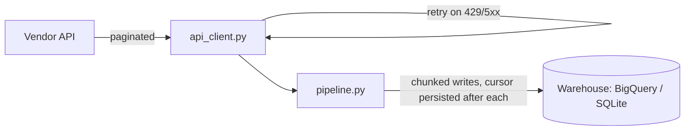

🟡 Portfolio demo, runnable locally, not deployed

# data-extraction-demo

Resumable extraction from a paginated vendor API into a warehouse, with retry-on-429 handling. One piece of a small multi-service platform demo, see [Related repos](#related-repos) for the rest.

This is a sanitized, generic rebuild for portfolio purposes. No real vendor, client, or company data is used anywhere in this repo. More context: [paulocremas-showcase](https://github.com/paulocremas-showcase). Full portfolio: [paulocremas.github.io](https://paulocremas.github.io).

## Table of contents
- [What this is](#what-this-is)
- [Flow](#flow)
- [Running it](#running-it)
- [Design notes](#design-notes)
- [Rules](#rules)
- [Related repos](#related-repos)

## What this is

A pull-side extraction job: page through a vendor API, land the data in a warehouse, and be safe to re-run after a crash without redoing finished work. This is the "extract" half of an extract/load platform, sibling to [data-etl-demo](https://github.com/paulocremas-showcase/data-etl-demo) which covers the concurrent-fetch variant of the same problem.

## Flow



1. [extraction/pipeline.py](extraction/pipeline.py) pages through the source, writing chunks and persisting a cursor after each one, so a crash resumes instead of restarting from item 1.
2. [extraction/api_client.py](extraction/api_client.py) retries on 429 and 5xx with backoff, the fix for a real production incident where a shared rate limit across pipelines caused intermittent silent data loss.
3. [extraction/sinks.py](extraction/sinks.py) has two sinks behind one interface: `BigQuerySink` (real, unmodified GCP client code) and `SQLiteSink` (so the demo runs with zero cloud setup).

## Running it

```
python3 -m venv .venv && source .venv/bin/activate
pip install -r requirements.txt

python -m extraction.pipeline --demo
```

Smoke tests: `python tests/test_pipeline.py`

To point at a real BigQuery project instead of the demo SQLite path, drop `--demo` and pass `--base-url`/`--project`.

## Design notes

- **Resumable cursor, not restart-from-zero.** A chunk only counts as done once its cursor is persisted, so a crash mid-run costs at most one chunk of rework.
- **429 is retryable, not fatal.** Treating a rate limit the same as a 5xx instead of a permanent 4xx error is one of the highest-leverage single-line fixes I've shipped in a real pipeline: it turned a recurring silent data-loss bug into a non-issue.
- **Parameterized queries only.** `BigQuerySink` never string-formats a query, even though this demo has no untrusted input, because that's the habit that matters once it does.

## Rules

- The demo path (`--demo`, SQLite) must never require GCP credentials to run.
- `BigQuerySink` stays real, working code, not a stub, even though the demo doesn't exercise it.
- No real vendor, client, or company names or data anywhere in this repo.

## Related repos

- [data-etl-demo](https://github.com/paulocremas-showcase/data-etl-demo) — same extract-and-load problem, concurrent-fetch variant
- [inventory-sync-demo](https://github.com/paulocremas-showcase/inventory-sync-demo) — the push/sync direction instead of pull
- [ai-enrichment-demo](https://github.com/paulocremas-showcase/ai-enrichment-demo) — enriches records after they land
- [ops-dashboard-demo](https://github.com/paulocremas-showcase/ops-dashboard-demo) — monitors all of the above for schedule collisions
